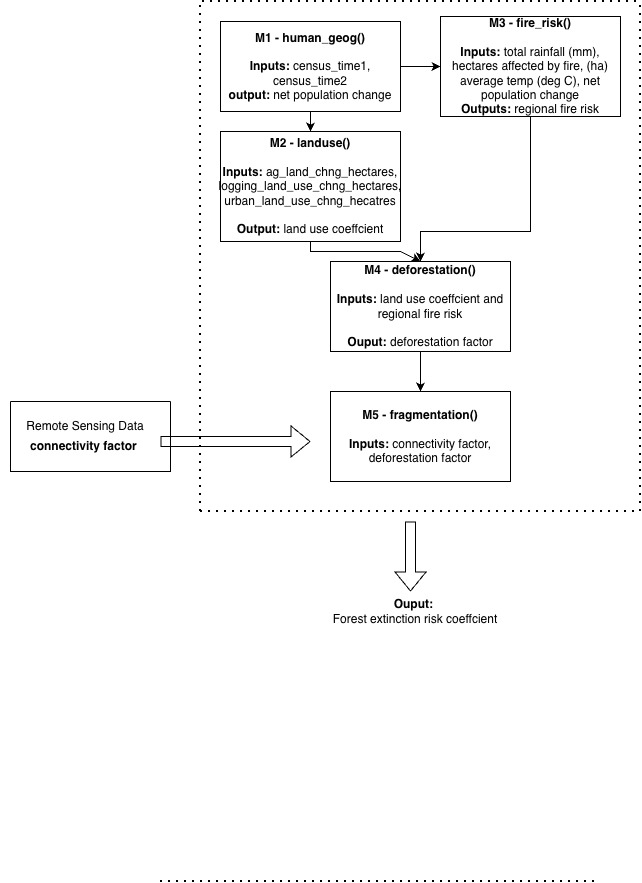

## Assignment 5 Instructions

With a partner, think of an example complex data science task/program that you might want to design with:

-   At least 3 modules
-   1 module must be used at least twice
-   At least one for (or while) loop

### Planning - Step 1

Sketch a diagram that shows how these modules would be put together to go from inputs to output for the overall program (30pts)

# Module Diagram



write a contract for the overall program (input, output, parameters) (10pts) break the program in to modules (naming them appropriately), write a contract for each one (20pts)

### Implementation - Step 2

Write functions (stored in separate documents) for each module (30pts) write an overall program that manages calls to each function (10pts) create some data and use it to test the program (10pts)

## Modules and Contracts

Our goal is to design modules to quantify forest extinction risk. Our five modules are human geography, land use, wildfire risk, deforestation, and habitat fragmentation.

### Overall Program Contract

Description: Given net population change, land use change, and climate data, we can estimate extinction risk of a species in the landscape by

-   Inputs

    -   pop_t1, pop_t2: regional population at two census time points (persons)

    -   forest_t1, forest_t2: total forest area at two time points (ha)

    -   ag_t1, ag_t2: agricultural area at two time points (ha)

    -   urban_t1, urban_t2: urban area at two time points (ha)

    -   rainfall: total annual rainfall (mm)

    -   hectares_burned: area affected by fire in prior year (ha)

    -   avg_temp: average annual temperature (°C)

    -   natural_forest_t1, natural_forest_t2: natural (non-plantation) forest area at two time points (ha)

    -   plantation_t1, plantation_t2: timber plantation area at two time points (ha)

    -   total_landscape_area: total area of the region (ha)

-   Output

    -   extinction_risk: the likelihood of extinction for a species in the landscape area (unitless; higher values = greater risk)

-   Parameters

    -   ecological weighting for natural forests vs. plantation loss
    -   population scaling factor

### (1) Human Geography Contract

Function Name: human_geog()

Description: Takes two census snapshots shows whether the regional population is growing or shrinking. A growing population typically signals increasing pressure on surrounding land.

-   Inputs
    -   pop_t1: population at earlier census (persons)
    -   pop_t2: population at later census (persons)
-   Output
    -   net_pop_change: difference between the two counts (positive = growth, negative = decline)
-   No parameters

### (2) Land Use Contract

Function name: land_use()

Description: Compares land cover area at two time points across forest, agricultural, and urban categories. The output summarizes how much land conversion pressure has occurred. This represents how much forest has been replaced by other uses.

-   Inputs:
    -   forest_t1: forest area at earlier time point (ha)
    -   forest_t2: forest area at later time point (ha)
    -   ag_t1: agricultural area at earlier time point (ha)
    -   ag_t2: agricultural area at later time point (ha)
    -   urban_t1: urban area at earlier time point (ha)
    -   urban_t2: urban area at later time point (ha)
-   Output
    -   land_use_coeff: combined land conversion in hectares (higher = more forest replaced by ag or urban land)
-   No parameters

### (3) Wildfire Risk Contract

Function name: wildfire_risk()

Description: Combines climate conditions (rainfall, temperature), recent fire history, population pressure, and land use change to estimate how fire-prone the region is. Drier, hotter, more disturbed landscapes with more people score higher.

-   Inputs
    -   rainfall: total annual rainfall (mm)
    -   hectares_burned: hectares affected by fire in prior year (ha)
    -   avg_temp: average annual temperature ( degrees C)
    -   net_pop_change: from calc_human_geog Module 1 (persons)
    -   landuse_coeff: from calc_land_use Module 2 (ha)
-   Output
    -   fire_risk_score: regional fire risk index (unitless; higher = greater risk)
-   Parameters
    -   population pressure scaling factor, default 0.001

### (4) Deforestation

Function name: deforestation()

Description: Calculates how much forest has actually been lost, treating natural forest loss as ecologically more significant than plantation loss. Fire risk amplifies the deforestation factor because fire both directly destroys forest and makes remaining forest more vulnerable.

-   Input
    -   natural_forest_t1: natural forest area at earlier time point (ha)
    -   natural_forest_t2: natural forest area at later time point (ha)
    -   plantation_t1: timber plantation area at earlier time point (ha)
    -   plantation_t2: timber plantation area at later time point (ha)
    -   fire_risk_score: regional fire risk score from calc_wildfire_risk() Module 3 (unitless)
-   Output
    -   defor_factor: weighted forest loss (ha adjusted for forest type; higher = greater ecological loss)
-   Parameters
    -   nat_weight: ecological weight for natural forest loss (0-1), default 0.8
    -   plan_weight: ecological weight for plantation loss (0-1), default 0.3

### (5) Habitat Fragmentation

Function name: habitat_frag()

Description: Takes the deforestation factor and the remaining natural forest area to estimate how broken up the landscape has become. A landscape that has lost a lot of forest and has little remaining is highly fragmented. Fragmented forests have patches of habitat that are small and isolated, which threatens species persistence.

-   Input
    -   natural_forest_t2: remaining natural forest area at later time point (ha)
    -   total_landscape_area: total area of the region being assessed (ha)
    -   defor_factor: deforestation factor from calc_deforestation() Module 4 (unitless)
-   Output
    -   fragmentation score: landscape fragmentation index (unitless; higher = more fragmented landscape)
-   Parameters
    -   small constant 0.001 added to connectivity denominator to prevent division by zero

## Running the Program

Call in functions:

```{r}
library(here)

source(here("functions/calc_human_geog.R"))
source(here("functions/calc_land_use.R"))
source(here("functions/calc_wildfire_risk.R"))
source(here("functions/calc_deforestation.R"))
source(here("functions/calc_habitat_frag.R"))
```

Create a dataframe:

```{r}

scenarios = data.frame(
  pop_t1 = c(50000, 45000, 70000), 
  pop_t2 = c(60000, 40000, 75000),
  forest_t1 = c(300000, 400000, 250000), 
  forest_t2 = c(200000, 350000, 200000), 
  ag_t1 = c(100000, 300000, 200000), 
  ag_t2 = c(150000, 400000, 125000), 
  urban_t1 = c(450000, 300000, 500000), 
  urban_t2 = c(600000, 350000, 600000), 
  rainfall = c(2000, 900, 1600), 
  hectares_burned = c(1800, 250, 980), 
  avg_temp = c(25, 31, 28), 
  natural_forest_t1 = c(200000, 250000, 100000), 
  natural_forest_t2 = c(150000, 150000, 175000), 
  plantation_t1 = c(100000, 150000, 150000), 
  plantation_t2 = c(50000, 200000, 25000), 
  total_landscape_area = c(1000000, 1200000, 1100000)  
)

```

Create a loop and test program

```{r}
run_extinction_risk <- function(scenarios) {
results <- data.frame(
  scenario          = integer(),
  net_pop_change    = numeric(),
  land_use_coeff    = numeric(),
  fire_risk_score   = numeric(),
  defor_factor      = numeric(),
  fragmentation_score = numeric(),
  extinction_risk   = numeric()
)

for (i in 1:nrow(scenarios)) {
  s <- scenarios[i, ]   
  
  # Module 1
  net_pop_change <- human_geog(s$pop_t1, s$pop_t2)
  
  # Module 2 
  land_use_coeff <- land_use(
    s$forest_t1, s$forest_t2,
    s$ag_t1,     s$ag_t2,
    s$urban_t1,  s$urban_t2
  )
  
  # Module 3
  fire_risk_score <- wildfire_risk(
    s$rainfall, s$hectares_burned, s$avg_temp,
    net_pop_change, land_use_coeff
  )
  
  # Module 4 
  defor_factor <- deforestation(
    s$natural_forest_t1, s$natural_forest_t2,
    s$plantation_t1,     s$plantation_t2,
    fire_risk_score
  )
  
  # Module 5
  fragmentation_score <- habitat_frag(
    s$natural_forest_t2,
    s$total_landscape_area,
    defor_factor
  )
  
  # Final extinction risk score
  extinction_risk <- (fire_risk_score * 0.3) +
                     (defor_factor / 1000 * 0.4) +
                     (fragmentation_score / 1000 * 0.3)
  
  # Store this iteration's results
  results <- rbind(results, data.frame(
    scenario            = i,
    net_pop_change      = net_pop_change,
    land_use_coeff      = land_use_coeff,
    fire_risk_score     = fire_risk_score,
    defor_factor        = defor_factor,
    fragmentation_score = fragmentation_score,
    extinction_risk     = extinction_risk
  ))
  print(results)
}
}
```
